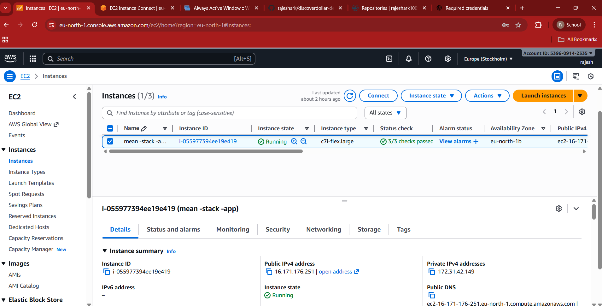
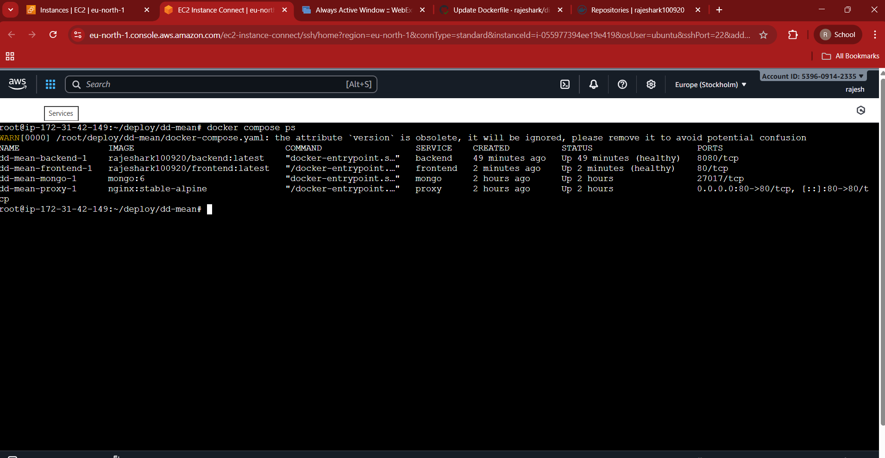
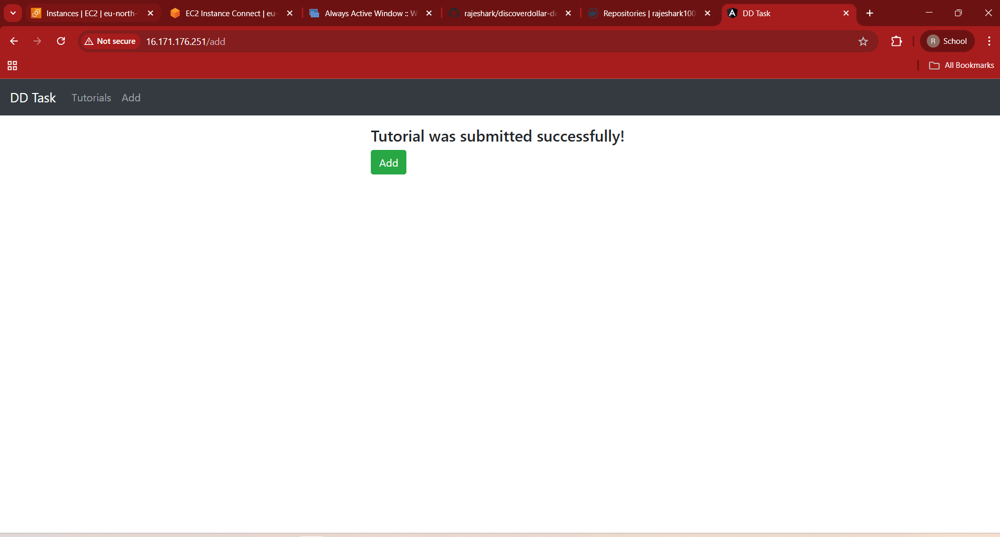
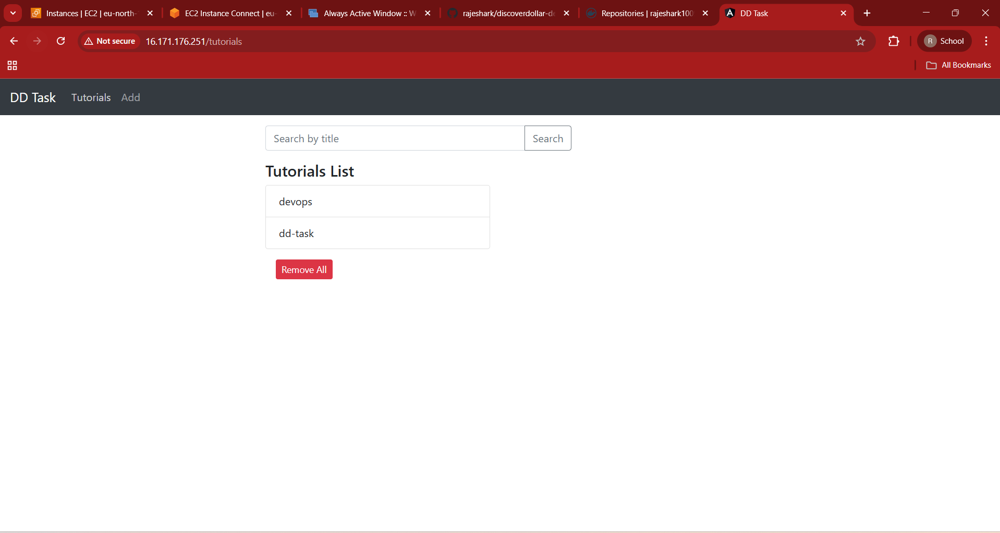
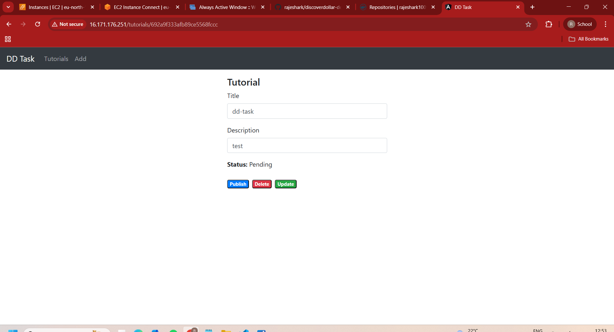
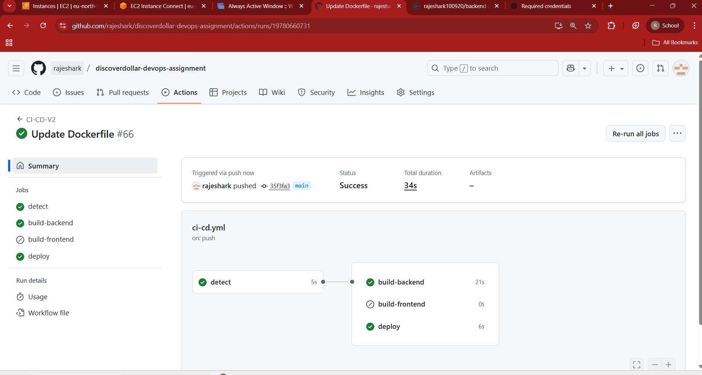
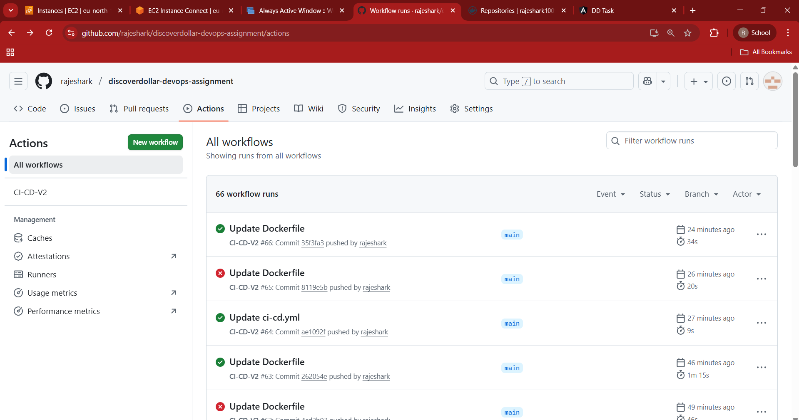

In this DevOps task, you need to build and deploy a full-stack CRUD application using the MEAN stack (MongoDB, Express, Angular 15, and Node.js). The backend will be developed with Node.js and Express to provide REST APIs, connecting to a MongoDB database. The frontend will be an Angular application utilizing HTTPClient for communication.  

The application will manage a collection of tutorials, where each tutorial includes an ID, title, description, and published status. Users will be able to create, retrieve, update, and delete tutorials. Additionally, a search box will allow users to find tutorials by title.

# step 1-  prepare the docker file ,.dockergitignore,docker-compose.yaml
## .dockerinore - 
prevent copying unnneccesy files into images such as :
- 'node_modules /',
- '.*logs /'
- '.idea/' 
- temporary files
do this image became small and which makes build and depoly faster

## docker-compose.yaml 
-used to manage ,define and run multicontainer app together . here wec define each container as service ,here we also careted custom network that is default on bridge network for conatiner communition also we attching data volumes to mangodb conatiner for data persistence so that data remains in volume even after container restart ,stoped or removed, . also restting restart policy unless-stoped  so the unless we stop manulaly it keeps running  automatically even docker daemon crash and restart , hostmachine  restart.

There are a total of **four containers**:
1. **Nginx reverse proxy** – using `nginx:stable` image  
2. **Frontend** – built using `frontend/Dockerfile`  
3. **Backend** – built using `backend/Dockerfile`  
4. **MongoDB** – using official `mongo:6` (or stable) image  

# Step 2: Push the Code to an Empty GitHub Repository

Use the following Git commands to push your project into a new GitHub repo:
-'git init/'
-'git add ./'
-'git commit -m "first commit"/'
-'git remote add origin https://github.com/rajeshark/discoverdollar-devops-assignment.git/'
-'git branch -M main/'
-git push -u origin main

# Step 3: prepare infrastructure in aws (ec2)
-use AMI OF EC2 IS ubuntu/'
-instance type -c7i-flex.large/'
-using -degault vpc is ok now not real word use custom vpc/'
-security group all ssh and http for anyware/'
-storage is 8-gp3/'

# step 4: connect to running ec2 using aws connect 
after connected to ec2 
1)update the sysem first
-sudo apt update && sudo apt upgrade -y/'

2)install docker 
sudo apt install -y apt-transport-https ca-certificates curl software-properties-common
curl -fsSL https://download.docker.com/linux/ubuntu/gpg | sudo gpg --dearmor -o /usr/share/keyrings/docker.gpg
echo \
  "deb [arch=$(dpkg --print-architecture) signed-by=/usr/share/keyrings/docker.gpg] \
  https://download.docker.com/linux/ubuntu $(lsb_release -cs) stable" \
  | sudo tee /etc/apt/sources.list.d/docker.list > /dev/null

sudo apt update
sudo apt install -y docker-ce docker-ce-cli containerd.io

3) Add User to Docker Group (avoid sudo)
sudo usermod -aG docker $USER
newgrp docker

4)Install Docker Compose (latest)
sudo curl -L "https://github.com/docker/compose/releases/latest/download/docker-compose-$(uname -s)-$(uname -m)" \
  -o /usr/local/bin/docker-compose

sudo chmod +x /usr/local/bin/docker-compose
docker-compose --version

5)install git for cloning
sudo apt install -y git

# step 5 after the above sofware install next github repo clone into ec2 beacse first time we do build docker images and run containers manually then later ci/cd will deploy continously .

create one project folder in ec2 then clone github repo to the folder using 
mkdir -p ~/deploy/dd-mean
cd ~/deploy/dd-mean
git clone https://github.com/rajeshark/discoverdollar-devops-assignment.git .

# step 6 set the .env file in dd-mean folder
using nano .env
set .env varibles 
MONGO_ROOT_USERNAME=root
MONGO_ROOT_PASSWORD=Rajesha1009
DB_NAME=dd_db
BACKEND_PORT=8080
DOCKERHUB_USERNAME=rajeshark100920

# step 7 build images loaclly during first then docker compose up
docker build -t rajesha100920/frontend ./frontend
docker build -t rajeha100920/backend ./backend
after this see the images - docker images
then using docker compose up -d  run the all containers here -d stands for detach mode
using docker compose ps see all container status 
if any problems chack logs of conatines using -docker logs container name

# step 8 use public ip of ec2 access the frontend ui result in broswer

# step 9 final step settiing the ci/cd pipeline
code is in .github/workflows/ci-cd.yml
1) set secrets for github action such as DOCKERHUB_TOKEN  -"DOCKER HUB access token "  
                                      DOCKERHUB_USERNAME- "dockerhub username"
                                      VM_HOST -"ec2 public ip "
                                      VM_SSH_KEY -"ssh-keygen private key"
                                      VM_SSH_PORT - "22"
                                      VM_USER -"root"
2) using ssh-keygen command generate public and private keys locally
-put the public key in ec2 vm in authorized_keys file
-put the private key in gith hub action secrets that is VM_SSH_KEY

3) connnect to ec2 and use vim /etc/ssh/sshd_config there edit config file such as -PermitRootLogin yes ,-PubkeyAuthentication yes  this make ssh of ci/cd to ec2 machine without password asking
                                                                                    
4) ok evrything seted  in pipeline code main concepts is when triggers comes manes if commit code
- 1) Github action first  cheack wheather the code changes where in frontend folder or backend or docker compose based on changes cases are
     if frontend folder code changes , no backend - only frontend image builded and pushed to docker hub then deploy this changes frotend containers only
     if no frontend , backend folder code changed - only bacakend image builded and pushed to docker hub and deploy only backend conatiner reamining running same
     if docker compose file changed then - both frontend and backend images builded and pushed to docker hub deploy latest images form docker hub both frontend and nackend
    if other then this onlt folder ,files cahnges all other steps in ci-cd skipped
result of ci/cd pipeline.

# step 10 result of ci/cd pipeline 

